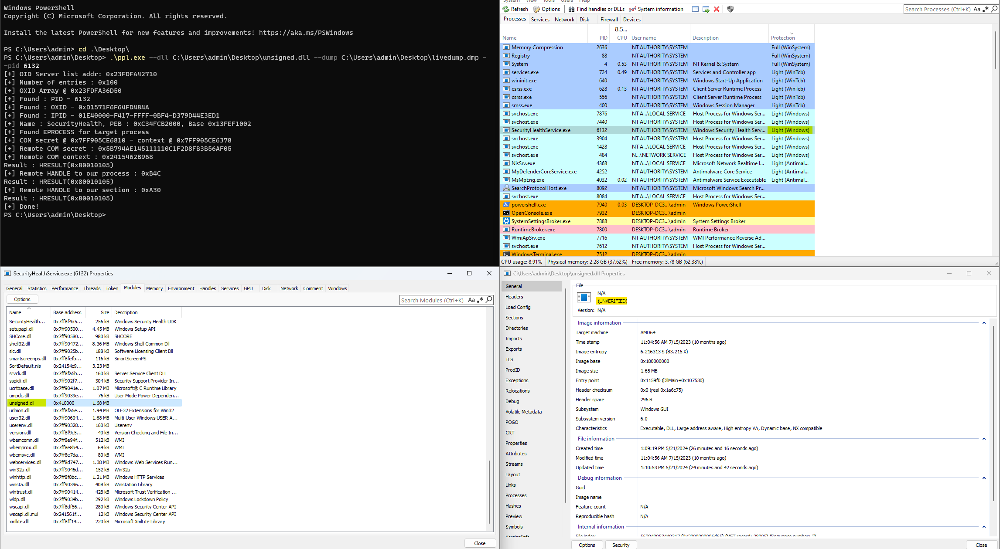

# PPLSystem

This is a proof of concept implementation of the technique described in [this blog post](https://blog.slowerzs.net/posts/pplsystem).

It creates a livedump of the machine through `NtDebugSystemControl` to extract the COM secret and context, to then inject inside this process. 

The livedump might slow down or freeze the machine for a couple of seconds.

The tool can be built using: `cargo build --release`.

## Usage 

```
pplsystem.exe --dll <path to the unsigned DLL to load> --dump <Full path where the dump file will be written> --pid <PID of the process to inject>
```



This proof of concept implements the mapping of an unsigned DLL inside a *PPL* process, however, no new thread is created, and the code in the unsigned DLL is not called.

For some reason, in a virtual machine, I've found that `services.exe` does not always initialize COM. In such cases, injection does not work. It works on other *PPL* process who do initialize COM.

I haven't faced this issue on a physical machine.

## Credits

- James Forshaw for the article [original article](https://googleprojectzero.blogspot.com/2018/11/injecting-code-into-windows-protected.html) on using COM remoting to inject into other processes.
- [Axel Souchet](https://x.com/0vercl0k) for his implementation of [kdmp-parser](https://github.com/0vercl0k/kdmp-parser/tree/master).
- [modexp](https://x.com/modexpblog) for the implemenation of [com_inject](https://github.com/mdsecactivebreach/com_inject/)
